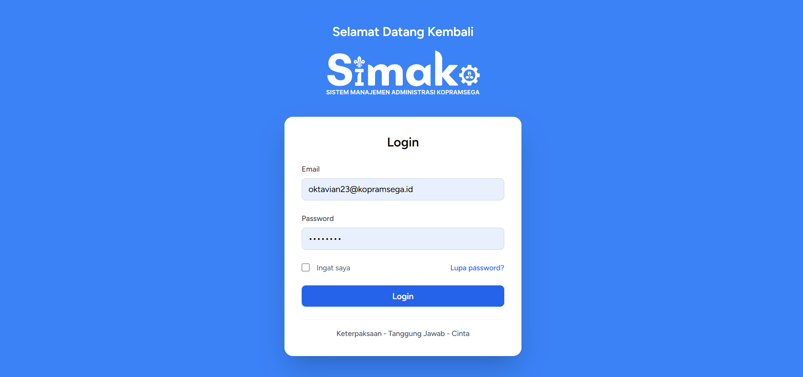
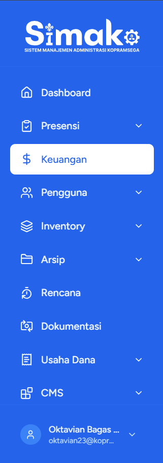
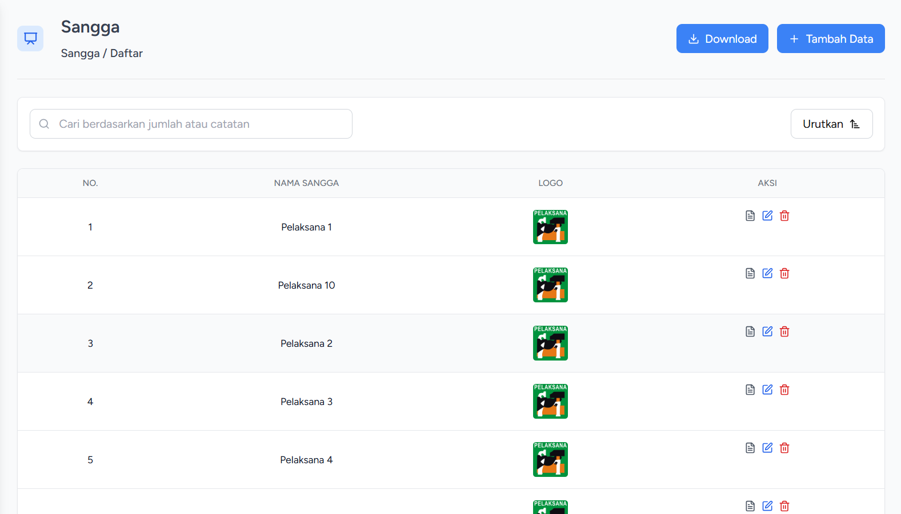
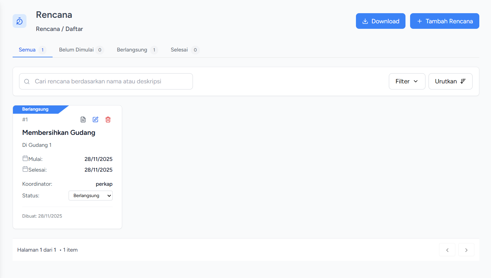
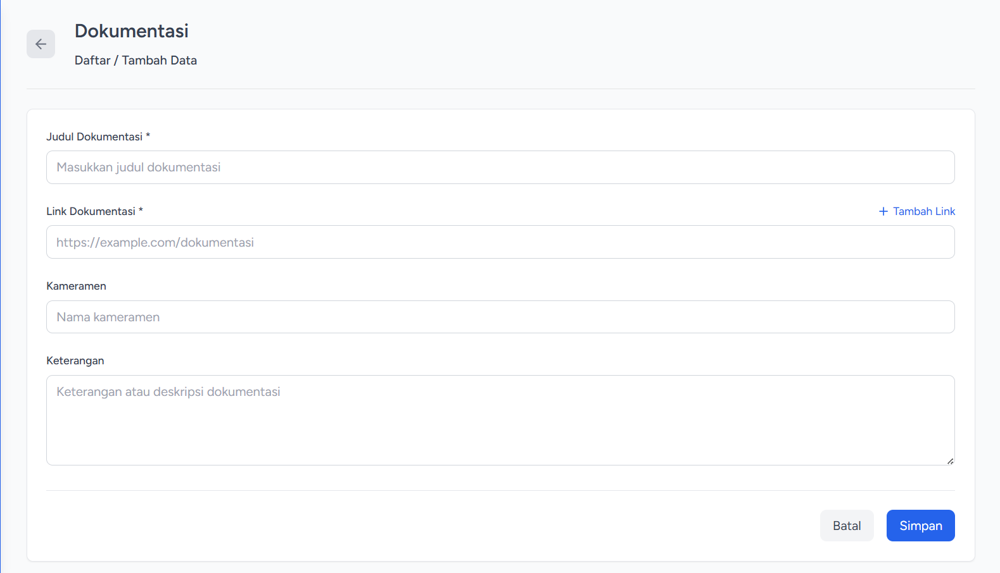
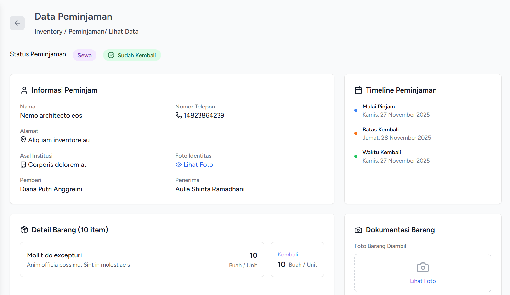
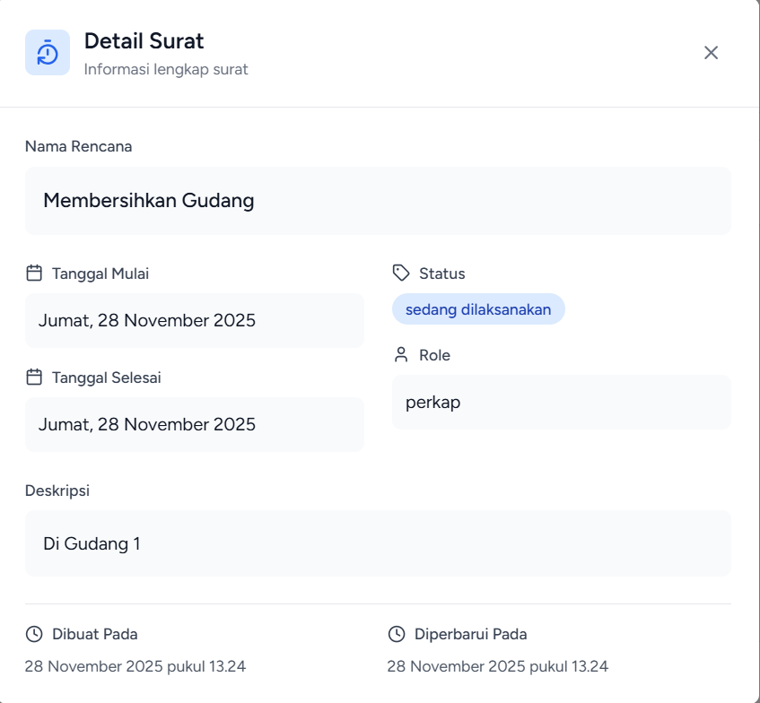
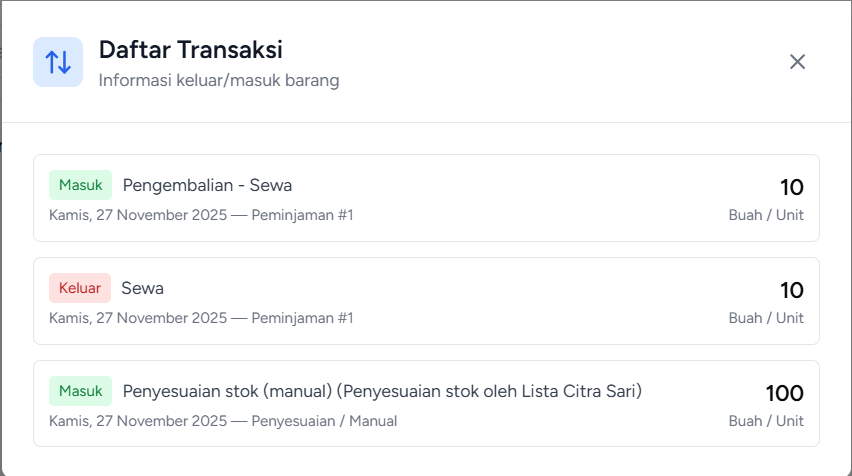
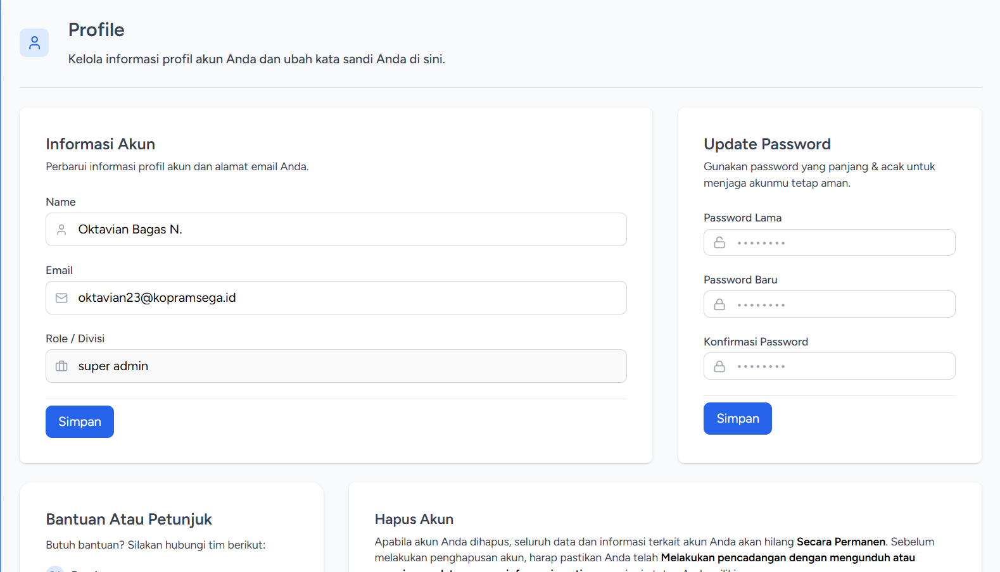

# SIMAKO — Sistem Manajemen Administrasi Kopramsega


---

**SIMAKO** *(**Si**stem **M**anajemen **A**dministrasi **Ko**pramsega)* adalah aplikasi web internal yang dirancang untuk **mendigitalisasi seluruh proses administrasi organisasi Kopramsega**, menggantikan sistem manual agar lebih cepat, akurat, terstruktur serta transparan. Aplikasi ini mencakup berbagai modul penting, mulai dari **pendataan keuangan**, **manajemen inventaris**, **arsip dokumen**, **penjualan**, **perencanaan**, **media informasi**, hingga **pengelolaan pengguna**.

Dengan arsitektur modern berbasis **Laravel** sebagai backend, SIMAKO mampu menangani autentikasi, manajemen data, dan logika bisnis secara aman dan terpusat. Sementara itu, **React** digunakan sebagai antarmuka pengguna (frontend) untuk memberikan pengalaman interaktif, responsif, dan mudah digunakan bagi pengurus organisasi.

Setiap modul dirancang untuk **meningkatkan efisiensi kerja pengurus**, mengurangi kesalahan administrasi manual, dan memberikan **visualisasi data yang jelas** agar pengambilan keputusan lebih cepat dan tepat.

---

## 🚀 Status Proyek

- Saat ini proyek berada dalam tahap **pengembangan aktif** dengan beberapa modul utama sudah mulai diimplementasikan.
- Fitur-fitur tambahan dan penyempurnaan akan terus dilakukan berdasarkan kebutuhan organisasi.

---

## 🎯 Tujuan Utama

- Menyajikan data penting organisasi dalam bentuk visual agar pengurus dapat mengambil keputusan lebih cepat dan tepat.
- Mempercepat serta menertibkan proses pendataan kehadiran untuk mengurangi potensi kesalahan pencatatan manual.
- Meningkatkan transparansi dan kerapian pencatatan keuangan sehingga laporan lebih mudah dibuat dan diaudit.
- Menjaga keamanan data melalui pembagian akses dan peran yang jelas pada setiap pengguna.
- Mengoptimalkan manajemen inventaris agar barang tidak mudah hilang dan seluruh pergerakan tercatat.
- Meningkatkan efisiensi penyimpanan dokumen sehingga mudah dicari tanpa risiko kerusakan fisik.
- Mendukung perencanaan kegiatan yang lebih terjadwal dan terdokumentasi dengan baik.
- Menyimpan dokumentasi kegiatan secara tersusun untuk kebutuhan evaluasi dan publikasi internal.
- Menjadikan transaksi usaha dana lebih efisien dan transparan dalam pencatatan serta pelaporan.
- Menyederhanakan pengelolaan konten informasi internal agar tetap konsisten dan terstruktur.
- Menyediakan pusat data anggota yang valid untuk mendukung seluruh proses administrasi dan transaksi pada unit organisasi.

---

## 🧩 Fitur yang Tersedia / Direncanakan

| Modul       | Fitur                                                                                      |
| ----------- | ------------------------------------------------------------------------------------------ |
| Dashboard   | Statistik dan ringkasan data                                                               |
| Presensi    | Kehadiran, Rekap                                                                           |
| Keuangan    | Manajemen dana dan transaksi                                                               |
| Pengguna    | Role, Manajemen akun user                                                                  |
| Inventory   | Barang, Stok, Peminjaman                                                                   |
| Arsip       | Surat, Dokumen                                                                             |
| Rencana     | Penjadwalan & rencana unit kerja                                                           |
| Dokumentasi | Media dokumentasi kegiatan                                                                 |
| Usaha Dana  | Sesi penjualan, Menu, Transaksi  |
| CMS         | Kategori, Tag, Posting           |
| Master Data | Data Siswa, Data Sangga                                                                    |

---

## 🛠️ Teknologi

| Teknologi                                                                                                      | Fungsi dalam Proyek                                                                           |
| -------------------------------------------------------------------------------------------------------------- | --------------------------------------------------------------------------------------------- |
| **Laravel 12**             | Mengelola backend, autentikasi, middleware, manajemen user & data administrasi organisasi     |
| **MySQL 8.0.30**                 | Database utama untuk menyimpan data anggota, inventaris, transaksi dan seluruh entitas sistem |
| **React**                        | Membangun antarmuka web modern yang interaktif dan cepat dengan konsep SPA                    |
| **TypeScript**            | Menjamin kualitas dan keamanan kode front-end melalui tipe data yang ketat                    |
| **Inertia.js**       | Menjembatani React & Laravel untuk routing SPA tanpa perlu API REST kompleks                  |
| **Vite**                            | Membuat proses development cepat (hot reload) dan bundling lebih efisien                      |
| **Tailwind CSS**  | Mempercepat pembuatan UI responsif berbasis utility-first styling                             |
| **Shadcn UI**         | Menyediakan komponen UI siap pakai berkualitas tinggi dan mudah dikustomisasi                 |
| **Lucide Icons**                 | Menyediakan ikon vektor modern untuk navigasi dan representasi fitur                          |

---

## 🖼️ Screenshot UI

> Tampilan hanya contoh, tidak seluruh tampilan ditampilkan di sini.

| Tampilan                       | Gambar                                                                              |
| ------------------------------ | ----------------------------------------------------------------------------------- |
| Login                          |                                             |
| Sidebar                        |                                           |
| Dashboard                      | _(coming soon)_                                                                     |
| Penampilan data (Tabel & Card) |      |
| Form Pengisian Data            |                                              |
| Show Data                      |                                              |
| Modal                          |   |
| Profil                         |                                            |

---

## 📦 Instalasi dan Menjalankan Aplikasi

> Install Laravel, Composer dan Node.js terlebih dahulu  
> Laravel: https://laravel.com/docs  
> Composer: https://getcomposer.org  
> Node.js: https://nodejs.org/en

```bash
# Clone repository
git clone https://github.com/oktavianbn/KopramsegaApp.git
cd KopramsegaApp

# Install backend dependencies
composer install

# Install frontend dependencies
npm install

# Copy ENV & generate key
cp .env.example .env
php artisan key:generate

# Migrasi database
php artisan migrate

# Jalankan server backend dan frontend
composer run dev

# Membuat akun di localhost/register
```

---

**Copyright © 2025 Simako Project Authors.** **All Rights Reserved.**
